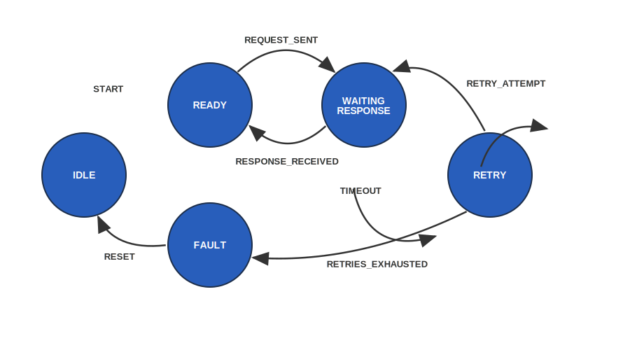

# Request / Response State Machine

This example models a common communication pattern in embedded systems:

- Send request  
- Wait for response  
- Handle timeout  
- Retry if needed  
- Enter fault state if retries are exhausted  

---

## 🧠 Design Goal

Most state machine examples focus on ideal scenarios.

In real embedded systems:

- responses may not arrive  
- communication can fail  
- timing matters  

👉 This example treats **timeout and retry as part of the normal flow**, not edge cases.

---

## 🔷 States

- `IDLE` → system is inactive  
- `READY` → normal operational state  
- `WAITING_FOR_RESPONSE` → waiting for external response  
- `RETRYING` → retrying after timeout  
- `FAULT` → retries exhausted, system in failure mode  

---

## 🔷 Events

- `START`
- `REQUEST_SENT`
- `RESPONSE_RECEIVED`
- `TIMEOUT`
- `RETRY_SENT`
- `RETRIES_EXHAUSTED`
- `RESET`

---

## 🔁 State Flow

```
IDLE --START--> READY

READY --REQUEST_SENT--> WAITING_FOR_RESPONSE

WAITING_FOR_RESPONSE --RESPONSE_RECEIVED--> READY
WAITING_FOR_RESPONSE --TIMEOUT--> RETRYING

RETRYING --RETRY_SENT--> WAITING_FOR_RESPONSE
RETRYING --RETRIES_EXHAUSTED--> FAULT

FAULT --RESET--> IDLE
```

---

## 📊 Diagram



---

## 💻 Implementation

### C version
See: state_machine.c

Features:
- enum-based states and events
- simple event dispatcher
- simulated execution flow via `main`

---

### C++ version
See: state_machine.cpp

Features:
- class-based design
- encapsulated state
- transition logging
- cleaner structure for extension

---

## ▶️ How to Run

### C
```
gcc state_machine.c -o fsm
./fsm
```

### C++
```
g++ state_machine.cpp -o fsm
./fsm
```

---

## 💡 Key Takeaways

- A state should represent a **real system condition**, not a code step  
- Transitions should be **event-driven and explicit**  
- Timeout and retry are **normal behavior in embedded systems**  
- Fault handling should be part of the design, not an afterthought  

---

## 🧩 Typical Use Cases

- UART / CAN communication  
- Device drivers  
- Request/response protocols  
- Embedded APIs  

---

## 📄 License

MIT License
